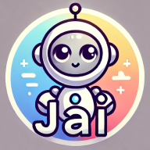

# PlaneWith : J로 만들어줄 AI 비서

### AI 비서와 함께하는 일정 관리 플랫폼

<a href="https://web-1-1-all-i-fe.vercel.app/" style="text-decoration: none;">PlanWith 웹사이트</a>

<br>

## 🙌 프로젝트 소개

AI 비서가 일정을 분배하고 캘린더에 자동으로 등록하는 데 도움을 줍니다.

캘린더를 활용하면 일정을 한눈에 파악하고 효율적으로 관리할 수 있습니다.
<br>
<br>

## 🔽 목차

- [프로젝트 소개](#-프로젝트-소개)
- [개발 기간](#-개발-기간)
- [프로젝트 팀원](#-프로젝트-팀원)
- [기술 스택](#️-기술-스택)
- [주요 기능](#주요-기능)
- [설치방법](#-설치방법)
<br>

## 📆 개발 기간

- 기획기간 : 2024.11.15 ~ 2024.11.22
- 개발기간 : 2024.11.25 ~ 2024.12.06
<br>

## 🧑‍💻 프로젝트 팀원

| **Frontend** | **Frontend** | **Frontend** | **Frontend** | 
| --- | --- | --- | --- |
| [서진혁](https://github.com/jinhyukSeo777) | [이가영](https://github.com/Ga-Zero) | [김우종](https://github.com/wilderif) | [조준영](https://github.com/JunYoung02) |

| **Backend** | **Backend** | **Backend** |
| --- | --- | --- |
| [이민정](https://github.com/TrixieL20) | [박윤영](https://github.com/pyy2114) | [정소은](https://github.com/sunnism03) |
<br>
<br>

## 🛠️ 기술 스택

### **Front-End**
 


<br>


### **Back-End**
 


<br>

## 💡 주요 기능

### 회원가입
- 이메일, 비밀번호, 닉네임을 작성해 회원가입을 진행할 수 있습니다.

<br>

### 개인화면
- 캘린더를 통해 일정이 있는 날들을 한눈에 확인할 수 있습니다.
- 아래에서 세부 일정을 확인할 수 있습니다.

<br>

### 그룹화면
- 그룹의 일정 정보를 확인할 수 있습니다.

<br>

### 챗봇
- AI를 통해 일정을 나눌 수 있습니다.
- 투두와 일정 등록 기능을 통해 반복 작업을 줄일 수 있습니다.

<br>

### 카테고리 관리
- 카테고리를 생성, 수정, 삭제할 수 있습니다.
- 카테고리별 색상을 지정해 캘린더에서 한눈에 확인할 수 있습니다.

<br>

### 일정 생성
- 제목, 날짜, 시간, 알림유무 등을 선택하여 작성할 수 있습니다.
- 그룹 일정은 추가로 할당된 인원을 지정할 수 있습니다.

<br>

### 실시간 알림
- 예정된 일정 시간에 알림을 받을 수 있습니다.
- 그룹 초대를 수락/거절 할 수 있습니다.

<br>

### 마이페이지
- 내 정보를 조회하고 수정할 수 있습니다.

<br>
<br>

## ⚒️ 시스템아키텍처


## 👀 설치방법

```bash
# 레포지토리 클론
git clone https://github.com/prgrms-web-devcourse-final-project/WEB1_1_ALL-I_FE.git

# 프로젝트 폴더로 이동
cd WEB1_1_ALL-I_FE

# 패키지 설치
npm install

# 프로젝트 실행
npm run dev
```
